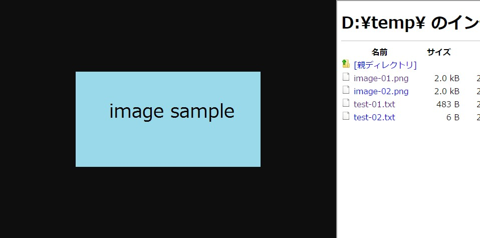

# これはなに？
ローカルファイルをChromeで閲覧時に同一フォルダの一覧を表示するChrome拡張

# メリット
* 同一ディレクトリの別のファイルを見るのが楽になる
* 1階層上に移動することも可能

# スクリーンショット
* テキストファイル閲覧時 (`D:\temp\test-01.txt`)
	<kbd></kbd>
* 画像ファイル閲覧時 (`D:\temp\image-01.png`)
	<kbd></kbd>
